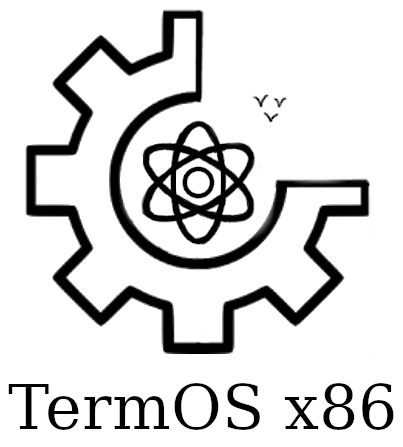

# TermOS x86-64

  

**TermOS x86-64** - 64-битная операционная система, написанная на **NASM** (**Netwide Assembler**) и **C++**. Поддерживает до 4 жестких дисков формата **FAT32**. 
Имеет собственный загрузчик, формата **MBR** (**Master Boot Record**), переводящий операционную систему из 16-битного режима работы процессора в 32-битный и затем в 64-битный режим. 
Поддерживает команды:

- `ls`: Показать список файлов и директорий в текущей директории.
- `cd`: Перейти в директорию (Поддерживает как относительный, так и абсолютные пути).
- `cat`: Отобразить содержимое файла.
- `rm`: Удалить файл или директорию.
- `mkdir`: Создать директорию.
- `pwd`: Отобразить абсолютный путь до текущей директории.
- `clear`: Очистить экран.
- `help`: Справка по командам.
- `touch`: Создать файл.
- `history`: Вывод последних вводимых команд, можно повторить вывод команды через !<номер команды>.

# Минимальные Системные Требования

- **RAM**: 5Мб+
- **CPU**: 64-битный Intel Pentium 4
- **Free Disk Space**: 30Kb+

# Загрузчик

Загрузчик запускается в 16-битном режиме работы процессора и проходит несколько стадий до перехода в 64-битный режим работы и передачи управления ядру.

- Проверка поддержки функций **EBIOS** (**Extended Basic Input Output**) и чтение диска через структуру **DAP** (**Disk Address Packet**).
- Активация линии **A20** и подготовка таблицы **GDT**.
- Переход в 32-битный режим работы.
- Настройка страничной адресации (**Paging**), переход в **Long Mode** и передача управления 64-битному ядру.

# Ядро

Ядро содержит библиотеки и модули:

- `ata` - Библиотека для настройки и работы **ATA** устройств.
- `fat32` - Библиотека для работы с файловой системой **FAT32**.
- `idt` - Библиотека для настройки и работы с таблицей прерываний (IRQ и ISR).
- `io` - Библиотека для работы с портами ввода/вывода.
- `iostream` - Высокоуровневая библиотека для работы с вводом-выводом в терминал.
- `pic` - Библиотека для работы с **Intel Programmable Interrupt Controller 8259A** контроллером прерываний.
- `pmm` - Библиотека для работы с аллокатором страниц по 4 Кб.
- `stdio` - Библиотека для ввода/вывода, не поддерживает потоки ввода/вывода, является абстракцией над видеобуфером.
- `string` - Библиотека для работы со строками (сравнение, получение длины строки, копирование строк, поиск символа)
- `syscall` - **Not Implemented!**. Библиотека системных вызовов.
- `task` - **Not Implemented!**. Библиотека для работы с многозадачностью.
- `tsh` - Пользовательская оболочка для исполнения команд (Работает с stdio, stdout, stderr).
- `vfs` - Виртуальная файловая система для поддержки потоков ввода/вывода (stdin, stdout, stderr)

# Как сохранить образ
- `make image`
- `sudo dd if=build/flash.img of=/dev/sdX bs=4M status=progress conv=fdatasync`

**Важное условие!**: Для запуска ОС, необходимо иметь виртуальный жесткий диск формата FAT32.
**Запуск:**
- `qemu-system-x86_64 -hda TermOS.bin -hdb fat32.img`

# Список полезных команд

- `udisksctl loop-setup -f disk.img`: Смонтировать диск в loop.
- `udisksctl loop-delete -b /dev/loopN`: Размонтировать loop.
- `losetup -a | grep disk.img`: Найти loop устройство по диску.

